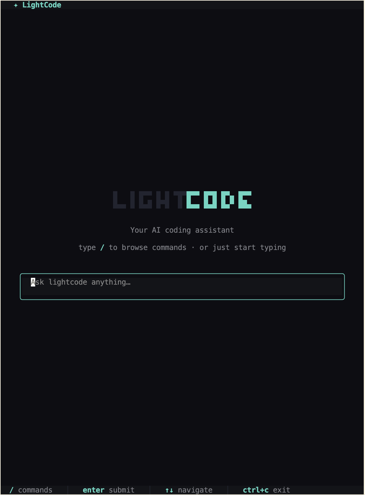
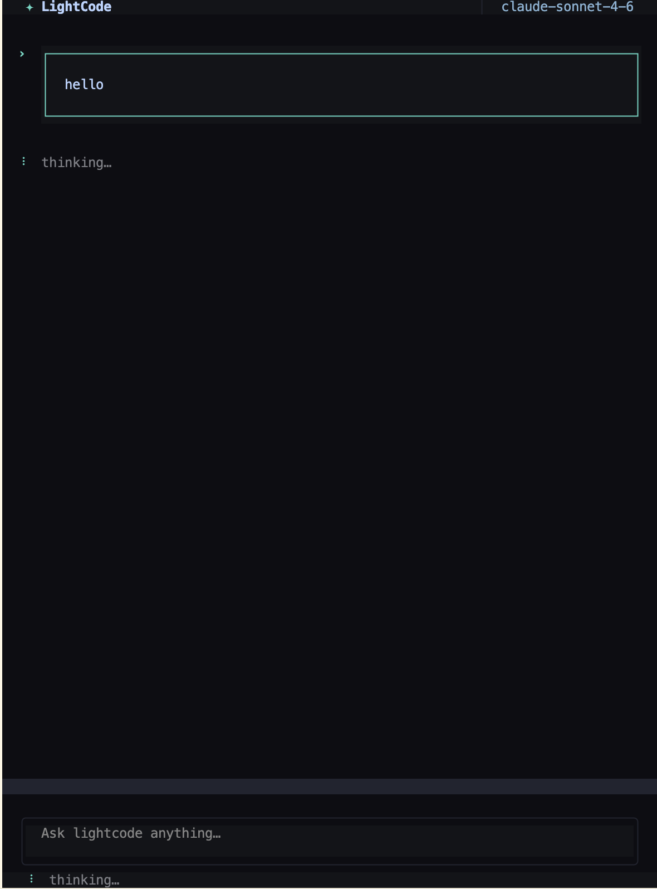

<div align="center">

# ✦ LightCode

**An AI coding agent that lives in your terminal.**  
Plan, chat, and build inside your local project — powered by Claude and OpenAI, streamed in real time.



</div>

---

## What it is

LightCode is a CLI-based SaaS coding assistant built on [Bun](https://bun.sh) and [OpenTUI](https://github.com/msmps/opentui). You open it in your project directory, describe what you want, and it reads, writes, and edits your files to get it done — all without leaving the terminal.



---

## Features

- **Streaming AI responses** — token-by-token output from Claude (Sonnet / Opus / Haiku) or OpenAI (GPT)
- **Agentic tool use** — reads files, writes files, edits code, runs shell commands, searches your codebase
- **PLAN / BUILD modes** — PLAN is read-only analysis; BUILD unlocks write and bash tools
- **Session persistence** — conversations are saved and resumable across restarts
- **10 built-in themes** — Nightfox, Catppuccin Mocha, Dracula, Tokyo Night, Nord, and more; persisted to `~/.lightcode/preferences.json`
- **Command palette** — type `/` to browse all commands: switch model, switch theme, browse sessions, upgrade, and more
- **Usage-based billing** — Polar-powered credit system; upgrade from inside the CLI
- **Clerk authentication** — OAuth login flow launched from the terminal; token stored at `~/.lightcode/auth.json`

---

## Tech stack

| Layer | Technology |
|---|---|
| Runtime | [Bun](https://bun.sh) |
| Terminal UI | [OpenTUI](https://github.com/msmps/opentui) + React 19 |
| Server | [Hono](https://hono.dev) |
| Database | [Prisma](https://prisma.io) + [Neon](https://neon.tech) (PostgreSQL) |
| AI | [AI SDK](https://sdk.vercel.ai) — Anthropic + OpenAI |
| Auth | [Clerk](https://clerk.com) |
| Billing | [Polar](https://polar.sh) |

---

## Project structure

```
lightcode/
├── packages/
│   ├── cli/          ← Terminal UI (OpenTUI + React)
│   ├── server/       ← Hono API (auth, chat, sessions, billing)
│   ├── database/     ← Prisma schema + client
│   └── shared/       ← Zod schemas + model definitions
├── docs/
│   ├── plan.md       ← Chapter-by-chapter build roadmap
│   └── branches/     ← Per-branch file-change guides
```

---

## Getting started

### Prerequisites

- [Bun](https://bun.sh) v1.x
- A [Neon](https://neon.tech) PostgreSQL database
- An [Anthropic](https://console.anthropic.com) API key (and optionally OpenAI)
- A [Clerk](https://clerk.com) application
- A [Polar](https://polar.sh) account (for billing)

### Install

```bash
git clone https://github.com/Hitesh-s0lanki/lightcode.git
cd lightcode
bun install
```

### Configure

Copy `.env.example` and fill in your credentials:

```bash
cp .env.example .env
```

```env
# Server
API_URL=http://localhost:3000

# Database
DATABASE_URL=postgresql://...

# AI
ANTHROPIC_API_KEY=sk-ant-...
OPENAI_API_KEY=sk-...

# Auth (Clerk)
CLERK_SECRET_KEY=sk_...
CLERK_PUBLISHABLE_KEY=pk_...

# Billing (Polar)
POLAR_ACCESS_TOKEN=...
POLAR_ORGANIZATION_ID=...
POLAR_PRODUCT_ID=...
POLAR_WEBHOOK_SECRET=...
```

### Set up the database

```bash
cd packages/database
bunx prisma migrate dev
```

### Run

Start the API server in one terminal:

```bash
bun run dev:server
```

Start the CLI in another:

```bash
bun run dev:cli
```

---

## Usage

### Keyboard shortcuts

| Key | Action |
|---|---|
| `/` | Open command palette |
| `Enter` | Submit message |
| `↑` `↓` | Navigate command menu |
| `Esc` | Close dialog / interrupt stream |
| `Ctrl+C` | Exit |

### Commands

| Command | Description |
|---|---|
| `/theme` | Switch color theme with live preview |
| `/models` | Select AI model |
| `/agents` | Toggle PLAN / BUILD mode |
| `/sessions` | Browse past conversations |
| `/login` | Sign in via browser |
| `/upgrade` | Buy more credits |
| `/usage` | Open billing portal |
| `/exit` | Quit the app |

### Modes

**PLAN** — read-only; the AI can analyze your code and answer questions but cannot modify files or run commands.

**BUILD** — full agentic mode; the AI can read files, write files, make targeted edits, run shell commands, and search your codebase to implement your request end-to-end.

---

## Development

This repo is organized as a series of feature branches, each matching a chapter of the build:

| Branch | What it adds |
|---|---|
| `features/project-setup-component-architecture` | Monorepo, OpenTUI shell, command menu |
| `features/ui-infrastructure` | Theme system, toasts, dialogs, keyboard layer |
| `features/routing-screen-layout` | Router, screens, session shell, message components |
| `features/server-shared-database` | Hono server, Prisma, shared types |
| `features/ai-chat-streaming` | Streaming chat, AI SDK, multi-provider |
| `features/session-management` | Session persistence, model/mode selection |
| `features/tool-calling` | File tools, bash, agentic loop |
| `features/user-experience` | Clerk OAuth, file mentions |
| `features/billing` | Polar credits, upgrade flow |
| `features/client-side-tools` | Tools moved to CLI, architecture refactor |

See [`docs/branches/`](./docs/branches/) for a per-branch file-change guide.

---

## License

MIT
